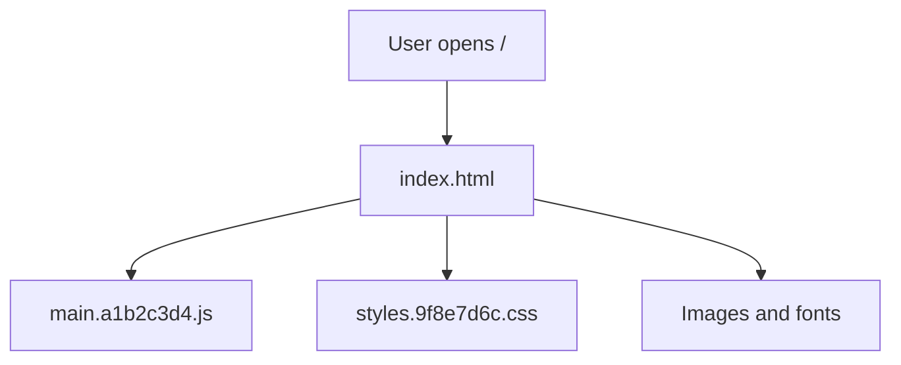
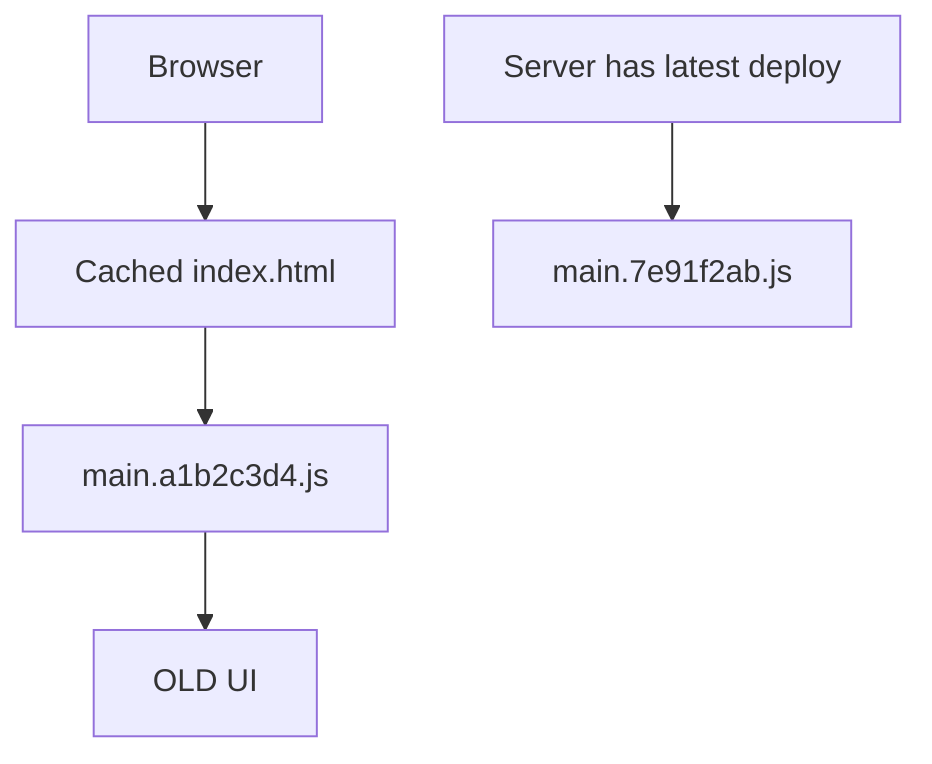
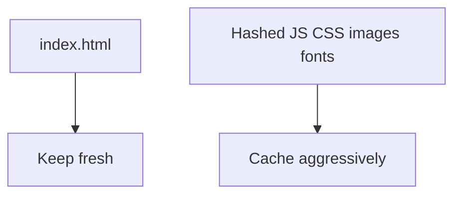

You deploy a new frontend. Someone reloads the page and still sees the old UI.

They press **Ctrl + Shift + R**, and suddenly the latest version appears.

That usually leads to:

> “The browser cache is broken.”

It isn’t. **The wrong file is being cached.**

`index.html` is being treated like a versioned asset, even though it’s the file that tells the browser which version of the app to load.

## How a page actually loads

A browser doesn’t cache “the website.” It caches individual files.



Each of those can have its own cache rules. That distinction matters, because hashed JavaScript and CSS are usually already fine.

## Hashed assets aren’t the problem

Builds produce content-hashed filenames:

```text
main.a1b2c3d4.js
styles.9f8e7d6c.css
```

Change the code, and the hash changes. A new deploy creates a new filename, so those files can be cached for a long time:

```http
Cache-Control: public, max-age=31536000, immutable
```

If the browser still has yesterday’s `main.a1b2c3d4.js`, that’s fine. The next deploy’s HTML points at `main.7e91f2ab.js` instead. The old bundle can sit in cache forever — the new HTML will never ask for it again.

Hashed assets are most of the bytes on the page. Caching them hard is what makes return visits fast. Turning caching off is not the fix.

## The real problem is `index.html`

Unlike assets, the shell usually keeps the same name: `index.html`. But its contents change every deploy:

```html
<!-- deploy 1 -->
<script src="/main.a1b2c3d4.js"></script>

<!-- deploy 2 -->
<script src="/main.7e91f2ab.js"></script>
```

So HTML is the entry point to the whole application. If the browser (or CDN) serves a cached copy, you get this:



The browser doesn’t know a deploy happened. It just thinks it already has `index.html`.

Missing `Cache-Control` doesn’t mean “no caching.” Browsers can fall back to **heuristic caching**, which is why one tester sees the new build and another doesn’t until they hard refresh.

CDNs and reverse proxies add another layer. Even a fresh browser request can still get stale HTML from the edge.

## Why hard refresh “works”

A normal reload can keep using a cached shell. A hard refresh forces a much more aggressive revalidate or bypass. That’s why **Ctrl + Shift + R** looks like a fix — it’s a workaround, not a deployment strategy.

## The fix: cache HTML and assets differently



| Resource                         | Cache policy                          |
| -------------------------------- | ------------------------------------- |
| `index.html`                     | `Cache-Control: no-cache`             |
| Hashed JS / CSS / images / fonts | `public, max-age=31536000, immutable` |
| `version.json` (if you use one)  | `no-cache`                            |

`no-cache` means “revalidate before using a stored copy,” not “never store it.” HTML is tiny. One cheap check beats re-downloading megabytes of JS because you disabled asset caching.

If a CDN caches HTML, **purge `/index.html` on every deploy** as well. Headers tell caches how to behave; a purge makes the cutover immediate.

Skip meta tags like `<meta http-equiv="Cache-Control">` — they don’t reliably control document caching. Don’t add a service worker just for this either; a bad SW creates the same stale-shell problem.

A passive “new version available” banner can help as a safety net. It is not a replacement for correct headers.

## Don’t break people mid-flow

Fresh HTML fixes what **new** sessions load. It doesn’t cover someone already deep in a booking or form when you deploy.

If you delete the previous build’s hashed chunks the instant the new one goes live, their next dynamic `import()` can 404 and blank the screen. Keep the last build or two around for a realistic session window. Don’t auto-reload the moment you detect a new version — offer an update when it’s safe, and catch chunk-load failures with a clear “refresh to continue” path. Persist mid-flow progress so a refresh doesn’t wipe their work.

## Takeaway

Keep `index.html` fresh. Cache hashed assets hard. Purge HTML at the CDN on deploy.

Do that, and a normal reload picks up the new version — no hard refresh required. Keep recent asset builds around so mid-flow users don’t trade “stale UI” for “blank screen on step 3.”
