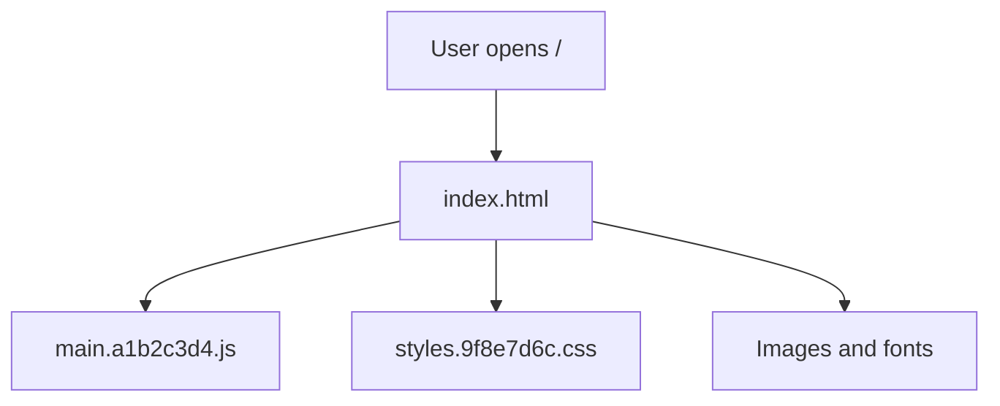
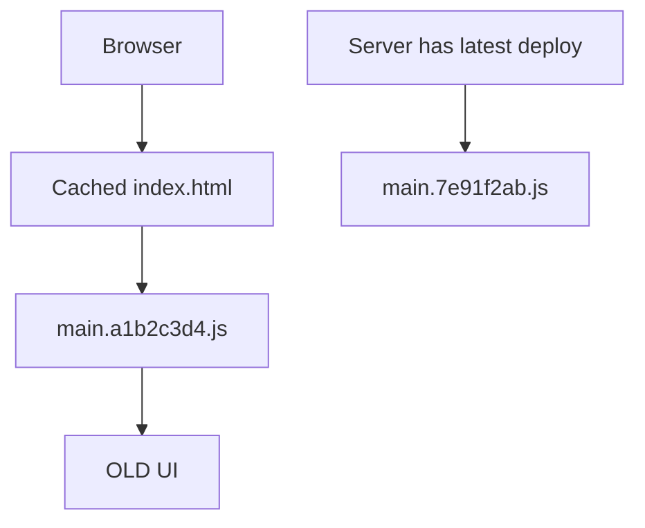
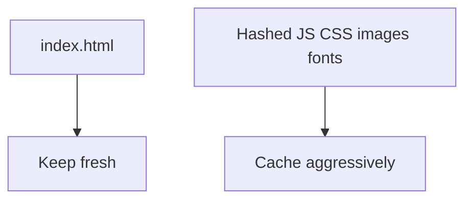
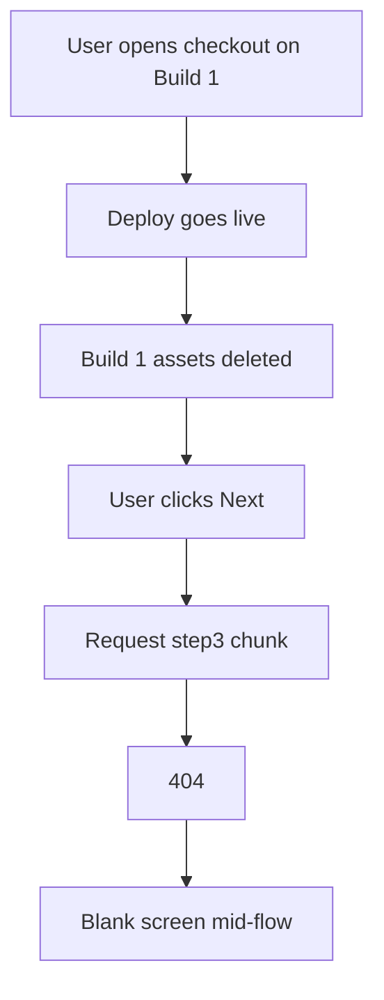
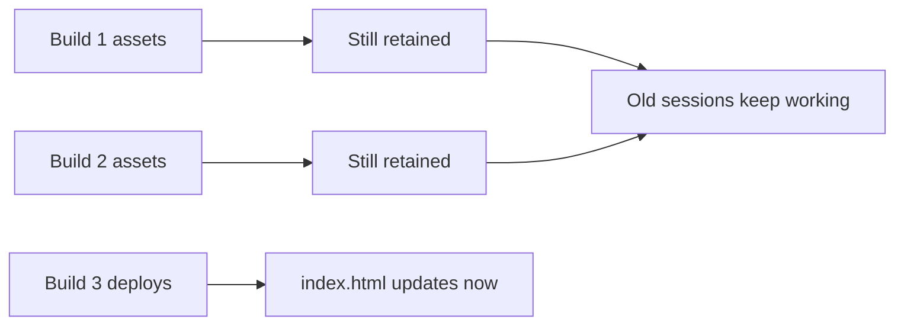

You deploy a new frontend. Someone reloads the page and still sees the old UI.

They press **Ctrl + Shift + R**, and suddenly the latest version appears.

I’ve watched this eat QA time and confuse people who swear the deploy never shipped.

That usually leads to:

> “The browser cache is broken.”

It isn’t. **The wrong file is being cached.**

`index.html` is being treated like a versioned asset, even though it’s the file that tells the browser which version of the app to load.

## How a page actually loads

A browser doesn’t cache “the website.” It caches individual files.



Each of those can have its own cache rules. That distinction matters, because hashed JavaScript and CSS are usually already fine.

## Hashed assets aren’t the problem

Builds produce content-hashed filenames:

```text
main.a1b2c3d4.js
styles.9f8e7d6c.css
```

Change the code, and the hash changes. A new deploy creates a new filename, so those files can be cached for a long time:

```http
Cache-Control: public, max-age=31536000, immutable
```

If the browser still has yesterday’s `main.a1b2c3d4.js`, that’s fine. The next deploy’s HTML points at `main.7e91f2ab.js` instead. The old bundle can sit in cache forever — the new HTML will never ask for it again.

Hashed assets are most of the bytes on the page. Caching them hard is what makes return visits fast. Turning caching off is not the fix.

## The real problem is `index.html`

Unlike assets, the shell usually keeps the same name: `index.html`. But its contents change every deploy:

```html
<!-- deploy 1 -->
<script src="/main.a1b2c3d4.js"></script>

<!-- deploy 2 -->
<script src="/main.7e91f2ab.js"></script>
```

So HTML is the entry point to the whole application. If the browser (or CDN) serves a cached copy, you get this:



The browser doesn’t know a deploy happened. It just thinks it already has `index.html`.

Missing `Cache-Control` doesn’t mean “no caching.” Browsers can fall back to **heuristic caching**, which is why one tester sees the new build and another doesn’t until they hard refresh.

CDNs and reverse proxies add another layer. Even a fresh browser request can still get stale HTML from the edge.

A normal reload can keep using that cached shell. A hard refresh forces a much more aggressive revalidate or bypass — that’s why **Ctrl + Shift + R** looks like a fix. It’s a workaround, not a deployment strategy.

## The fix: cache HTML and assets differently



| Resource                         | Cache policy                          |
| -------------------------------- | ------------------------------------- |
| `index.html`                     | `Cache-Control: no-cache`             |
| Hashed JS / CSS / images / fonts | `public, max-age=31536000, immutable` |
| `version.json` (if you use one)  | `no-cache`                            |

`no-cache` means “revalidate before using a stored copy,” not “never store it.” HTML is tiny. One cheap check beats re-downloading megabytes of JS because you disabled asset caching.

Do that at the server or CDN. If an edge cache is involved, purge HTML on deploy too.

A few things that don’t replace this:

- Meta tags like `<meta http-equiv="Cache-Control">` — not reliable for the HTML document
- A service worker added only for this — another cache layer that can recreate the same bug
- A `/version.json` “update available” banner — useful safety net, not a substitute for headers

## But what if someone is mid-flow when we deploy?

Keeping `index.html` fresh fixes the stale-UI problem.

It doesn’t cover someone already deep in a checkout or long form when you deploy. Those people shouldn’t get yanked onto new code mid-step, and they shouldn’t lose the old code out from under them either.

> **Freshness is for new sessions. Leave in-progress ones alone until they finish or choose to reload.**

### Chunk-load errors

Most SPAs code-split. The first bundle only loads what’s needed up front. Hitting step 3 of a multi-step flow can trigger a dynamic `import()` for something like:

```text
step3.9f8e7d.js
```

If the deploy wipes the previous build’s files as soon as the new one goes live, anyone who opened the page on the old build still has HTML and app state that point at hashes that no longer exist. Their next dynamic import 404s.



That’s worse than showing an old UI. It breaks an action in progress.

### Keep old hashed builds around for a grace period

Don’t delete the previous build the instant the next one ships. Keep the last one or two builds’ hashed JS/CSS/assets on the origin (or CDN) long enough to cover a realistic session — an hour, a day, whatever fits your product.



`index.html` can still update right away. Sessions that still reference older hashes can keep fetching those files until they reload on their own.

### Don’t force a live session onto new code

The version-check banner matters here. Auto-reloading the moment you detect a new version is a bad idea in the middle of a flow.

| Behaviour                                    | Safe mid-flow? |
| -------------------------------------------- | -------------- |
| Auto-reload when a new version is detected   | No             |
| Passive “Update available” banner            | Yes            |
| Prompt only between steps / after completion | Yes            |
| Skip the check while a flow is active        | Yes            |

Simplest version: set something like `flowInProgress = true` and only offer the update once that flag clears.

### Handle chunk-load failures anyway

Someone will leave a tab open longer than your retention window. Catch failed dynamic imports so you don’t get a blank page. Show a clear message — e.g. this step needs a refresh — and let them save progress first if you can.

### Make the flow survive a refresh

Persist step progress (selections, form fields) to the backend or local storage as they go. Then a refresh — accidental, forced, or after a chunk failure — picks up where they left off instead of starting over.

### Putting it together

`index.html` policy decides what a **new** visitor gets. Asset retention and non-forced update prompts decide what happens to someone already halfway through checkout. A multi-step flow needs both — and if the API is changing too, you may also need sticky sessions so a user stays on one backend for the rest of the session.

## Takeaway

Keep `index.html` fresh. Cache hashed assets hard. Purge HTML at the CDN on deploy — so a normal reload picks up the new version, no hard refresh required.

And protect in-flight sessions: retain recent hashed builds, don’t force-reload mid-flow, catch chunk failures, and persist progress. Otherwise you trade “stale UI” for “blank screen on step 3.”
